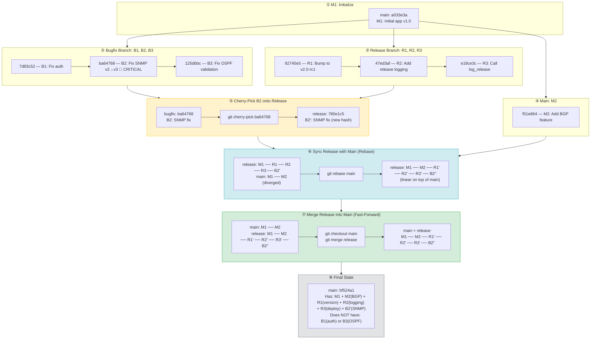

# Git Cherry-Pick, Rebase & Merge — Practice Lab

> **Lab path:** `~/DevnetExpert/mock3/design/git-ops`

---

## The Scenario

A realistic release workflow with three branches and one shared file (`app.py`):

```
1. main:      M1 (initial app v1.0)
2. bugfix:    B1, B2, B3 (bug fixes — different sections of app.py)
3. release:   R1, R2, R3 (release prep — version bump, logging)
4. main:      M2 (new BGP feature added)
5. Cherry-pick B2 onto release (critical SNMP fix needed for release)
6. Sync release with main (rebase — get M2 onto release)
7. Merge release into main (final software release)
```

**The key constraint:** Release needs the SNMP fix (B2) from bugfix, but NOT B1 or B3. That's why we cherry-pick — surgical, single commit transfer.

---

## Step 1 — Initialize and Create M1

```bash
cd ~/DevnetExpert/mock3/design/git-ops
git init

cat > app.py << 'EOF'
# === Network Automation App v1.0 ===

# --- Auth Section ---
def authenticate(user, password):
    print(f"Authenticating {user}")
    return True

# --- SNMP Section ---
def snmp_poll(device):
    print(f"Polling {device} via SNMPv2")
    return {"status": "ok"}

# --- OSPF Section ---
def configure_ospf(router, area):
    print(f"Configuring OSPF area {area} on {router}")

# --- Telemetry Section ---
def push_telemetry(target):
    print(f"Pushing telemetry to {target}")

# --- Main ---
if __name__ == "__main__":
    authenticate("admin", "cisco123")
    snmp_poll("192.168.89.71")
    configure_ospf("R1", 0)
    push_telemetry("10.0.0.1")
EOF

git add app.py
git commit -m "M1: Initial app v1.0"
```

```
* a033e3a (HEAD -> main) M1: Initial app v1.0
```

---

## Step 2 — Create Bugfix Branch (B1, B2, B3)

Each commit fixes a different section of `app.py`:

```bash
git checkout -b bugfix

# B1 — Fix auth (enforce min password length)
sed -i 's/return True/return len(password) >= 8/' app.py
git add app.py
git commit -m "B1: Fix auth - enforce min password length"

# B2 — Fix SNMP (upgrade v2 to v3) ← CRITICAL — needed on release
sed -i 's/SNMPv2/SNMPv3/' app.py
sed -i 's/return {"status": "ok"}/return {"status": "ok", "version": "v3"}/' app.py
git add app.py
git commit -m "B2: Fix SNMP - upgrade v2 to v3 (CRITICAL)"

# B3 — Fix OSPF (add area validation)
sed -i 's/print(f"Configuring OSPF area {area} on {router}")/if area < 0: raise ValueError("Invalid area")\n    print(f"Configuring OSPF area {area} on {router}")/' app.py
git add app.py
git commit -m "B3: Fix OSPF - add area validation"
```

```
* 125dbbc (HEAD -> bugfix) B3: Fix OSPF - add area validation
* ba64768 B2: Fix SNMP - upgrade v2 to v3 (CRITICAL)    ← NOTE THIS HASH
* 7d83c52 B1: Fix auth - enforce min password length
* a033e3a (main) M1: Initial app v1.0
```

---

## Step 3 — Create Release Branch from Main (R1, R2, R3)

**Important:** Create release from `main`, NOT from `bugfix`. Release should start clean from M1.

```bash
git checkout main
git checkout -b release
```

### R1 — Bump version

```bash
sed -i 's/v1.0/v2.0-rc1/' app.py
git add app.py
git commit -m "R1: Bump version to v2.0-rc1"
```

### R2 — Add release logging function

```bash
sed -i 's/if __name__ == "__main__":/def log_release():\n    print("Release v2.0-rc1 initialized")\n\nif __name__ == "__main__":/' app.py
git add app.py
git commit -m "R2: Add release logging function"
```

### R3 — Call log_release() in main block

```bash
sed -i 's/push_telemetry("10.0.0.1")/push_telemetry("10.0.0.1")\n    log_release()/' app.py
git add app.py
git commit -m "R3: Call release logging in main"
```

```
* e18ce3c (HEAD -> release) R3: Call release logging in main
* 47ed3af R2: Add release logging function
* 92745e5 R1: Bump version to v2.0-rc1
* a033e3a (main) M1: Initial app v1.0
```

---

## Step 4 — Add M2 on Main (New Feature)

```bash
git checkout main

sed -i '/# --- Main ---/i # --- BGP Section ---\ndef configure_bgp(asn, neighbor):\n    print(f"BGP AS{asn} peer {neighbor}")\n' app.py
git add app.py
git commit -m "M2: Add BGP configuration feature"
```

---

## Step 5 — Verify Graph (3 Branches Diverged)

```bash
git log --oneline --graph --all
```

```
* f51e864 (HEAD -> main) M2: Add BGP configuration feature
| * e18ce3c (release) R3: Call release logging in main
| * 47ed3af R2: Add release logging function
| * 92745e5 R1: Bump version to v2.0-rc1
|/
| * 125dbbc (bugfix) B3: Fix OSPF - add area validation
| * ba64768 B2: Fix SNMP - upgrade v2 to v3 (CRITICAL)
| * 7d83c52 B1: Fix auth - enforce min password length
|/
* a033e3a M1: Initial app v1.0
```

```
bugfix:   M1 ── B1 ── B2 ── B3

main:     M1 ── M2

release:  M1 ── R1 ── R2 ── R3
```

---

## Step 6 — Cherry-Pick B2 onto Release

Only the SNMP fix. Not B1, not B3 — just B2:

```bash
git checkout release
git cherry-pick ba64768
```

```
Auto-merging app.py
[release 780e1c5] B2: Fix SNMP - upgrade v2 to v3 (CRITICAL)
```

```
git log --oneline
780e1c5 (HEAD -> release) B2: Fix SNMP - upgrade v2 to v3 (CRITICAL)
e18ce3c R3: Call release logging in main
47ed3af R2: Add release logging function
92745e5 R1: Bump version to v2.0-rc1
a033e3a M1: Initial app v1.0
```

B2 copied to release as `780e1c5` (new hash). Original `ba64768` still on bugfix — untouched.

---

## Step 7 — Sync Release with Main (Rebase)

Release needs M2 (BGP feature) before final merge. Rebase replays R1, R2, R3, B2' on top of main's latest commit:

```bash
git rebase main
```

```
Successfully rebased and updated refs/heads/release.
```

All hashes changed — rebase creates new commits because the parent changed:

| Before Rebase | After Rebase | Content |
|---|---|---|
| `92745e5` R1 | `3a7376f` R1' | Same — version bump |
| `47ed3af` R2 | `71c528e` R2' | Same — logging function |
| `e18ce3c` R3 | `201fbf4` R3' | Same — call log_release |
| `780e1c5` B2' | `bf524a1` B2'' | Same — SNMP v3 fix |

```bash
git log --oneline --graph --all
```

```
* bf524a1 (HEAD -> release) B2: Fix SNMP - upgrade v2 to v3 (CRITICAL)
* 201fbf4 R3: Call release logging in main
* 71c528e R2: Add release logging function
* 3a7376f R1: Bump version to v2.0-rc1
* f51e864 (main) M2: Add BGP configuration feature
| * 125dbbc (bugfix) B3: Fix OSPF - add area validation
| * ba64768 B2: Fix SNMP - upgrade v2 to v3 (CRITICAL)
| * 7d83c52 B1: Fix auth - enforce min password length
|/
* a033e3a M1: Initial app v1.0
```

Release is now linear on top of main. Ready to merge.

---

## Step 8 — Merge Release into Main (Final Release)

```bash
git checkout main
git merge release
```

```
Updating f51e864..bf524a1
Fast-forward
```

Fast-forward — no merge commit needed because release sits linearly ahead of main.

```bash
git log --oneline --graph --all
```

```
* bf524a1 (HEAD -> main, release) B2: Fix SNMP - upgrade v2 to v3 (CRITICAL)
* 201fbf4 R3: Call release logging in main
* 71c528e R2: Add release logging function
* 3a7376f R1: Bump version to v2.0-rc1
* f51e864 M2: Add BGP configuration feature
| * 125dbbc (bugfix) B3: Fix OSPF - add area validation
| * ba64768 B2: Fix SNMP - upgrade v2 to v3 (CRITICAL)
| * 7d83c52 B1: Fix auth - enforce min password length
|/
* a033e3a M1: Initial app v1.0
```

---

## Step 9 — Verify Final State

```bash
# SNMP upgraded to v3 (from cherry-picked B2)
grep -i snmp app.py
# Polling {device} via SNMPv3

# BGP feature present (from M2)
grep -i bgp app.py
# BGP AS{asn} peer {neighbor}

# Release logging present (from R2/R3)
grep -i release app.py
# Release v2.0-rc1 initialized
```

### What main has vs what it doesn't

| Content | Source | On main? |
|---|---|---|
| SNMPv3 fix | B2 (cherry-picked) | ✅ Yes |
| BGP feature | M2 | ✅ Yes |
| Version v2.0-rc1 | R1 | ✅ Yes |
| Release logging | R2, R3 | ✅ Yes |
| Auth password check | B1 | ❌ No — stayed on bugfix |
| OSPF area validation | B3 | ❌ No — stayed on bugfix |

---

## Cleanup

```bash
git branch -d release
# git branch -d bugfix    # optional — keep if you want B1/B3 later
```

---

---

## Fixing Commit Mistakes

### Scenario: Wrong Commit Message

Committed R2's work with message "R3: Call release logging in main" — wrong label.

### Method 1: `git commit --amend` (Fix the Last Commit)

```bash
git commit --amend -m "R2: Add release logging function"
```

Rewrites the last commit's message (or content if you `git add` first). Only works for the **most recent** commit.

### Method 2: `git rebase -i HEAD~N` (Fix Older Commits)

When the commit you need to fix isn't the latest one, use interactive rebase:

```bash
git rebase -i HEAD~1
```

Editor opens with:

```
pick 47ed3af R3: Call release logging in main
```

Change `pick` to `reword`:

```
reword 47ed3af R3: Call release logging in main
```

Save and close. A second editor opens — change the message:

```
R2: Add release logging function
```

Save and close. Done — commit hash changes because the message changed.

**Interactive rebase keywords:**

| Keyword | What It Does |
|---|---|
| `pick` | Keep commit as-is |
| `reword` | Keep changes, edit the **message** |
| `edit` | Pause at this commit — lets you amend content + message |
| `squash` | Merge this commit into the one above it, combine messages |
| `fixup` | Merge into above, **discard** this commit's message |
| `drop` | Delete the commit entirely |

**Example — squash last 3 commits into 1:**

```bash
git rebase -i HEAD~3
```

```
pick aaa1111 R1: Bump version
squash bbb2222 R2: Add logging
squash ccc3333 R3: Call logging
```

Result: one commit with combined changes.

### Method 3: `git reset --soft HEAD~N` (Undo and Redo)

```bash
# Undo last commit, keep changes staged
git reset --soft HEAD~1

# Now recommit with correct message
git commit -m "R2: Add release logging function"
```

| Reset Flag | Changes | Staging Area | Commit |
|---|---|---|---|
| `--soft` | ✅ Kept | ✅ Kept (staged) | ❌ Undone |
| `--mixed` (default) | ✅ Kept | ❌ Unstaged | ❌ Undone |
| `--hard` | ❌ Deleted | ❌ Deleted | ❌ Undone |

### Method 4: `git revert HEAD` (Safe Undo for Shared Branches)

```bash
git revert HEAD
```

Creates a **new commit** that reverses the last one. Original commit stays in history. Safe for branches that are already pushed/shared — doesn't rewrite history.

```
BEFORE revert:
M1 ── M2 ── BAD

AFTER revert:
M1 ── M2 ── BAD ── UNDO-BAD    ← new commit, BAD still in history
```

### When to Use Which

| Situation | Command | Why |
|---|---|---|
| Fix the **last** commit (message or content) | `git commit --amend` | Simplest — rewrites in place |
| Fix an **older** commit's message | `git rebase -i HEAD~N` → `reword` | Can reach back N commits |
| Fix an **older** commit's content | `git rebase -i HEAD~N` → `edit` | Pauses for you to amend |
| Undo last commit, redo it entirely | `git reset --soft HEAD~1` | Keeps changes staged |
| Undo on a **shared/pushed** branch | `git revert HEAD` | Safe — no history rewrite |

**Golden rule:** If it's already pushed — use `revert`. If it's local — `amend`, `rebase -i`, or `reset`.

---

---

## Workflow — Mermaid Graph



**Color key:**
- 🟡 **Yellow** — Cherry-pick (selective commit transfer)
- 🔵 **Blue** — Rebase/Sync (linearize history)
- 🟢 **Green** — Merge/Deliver (final release)
- ⚪ **Grey** — Final state

---

## Cherry-Pick Command Reference

| Command | What It Does |
|---|---|
| `git cherry-pick <hash>` | Copy **one** commit to current branch |
| `git cherry-pick <A> <B> <C>` | Copy **multiple specific** commits |
| `git cherry-pick A^..C` | Copy a **range** A through C (inclusive) |
| `git cherry-pick --no-commit <hash>` | Apply changes but **don't auto-commit** |
| `git cherry-pick --continue` | After resolving conflict, continue |
| `git cherry-pick --abort` | Cancel and go back to before cherry-pick |
| `git cherry-pick --skip` | Skip current conflicting commit, move to next |

---

## Cherry-Pick vs Format-Patch (Offline Cherry-Pick)

`git format-patch` solves the same problem as cherry-pick — move specific commits to another branch — but via **patch files** instead of direct Git commands. Use it when branches are in different repos, different machines, or you can't access the other branch directly.

### Cherry-pick (same repo — direct)

```bash
git checkout release
git cherry-pick ba64768
# Done.
```

### Format-patch (cross-repo — via file transfer)

```bash
# On the bugfix machine — export B2 as a patch file
git checkout bugfix
git format-patch -1 ba64768
# Creates: 0001-B2-Fix-SNMP-upgrade-v2-to-v3-CRITICAL.patch

# Transfer the .patch file (email, USB, SCP, whatever)
scp 0001-B2-Fix-SNMP*.patch user@release-server:~/

# On the release machine — apply it
git checkout release
git am 0001-B2-Fix-SNMP-upgrade-v2-to-v3-CRITICAL.patch
# Done. Commit created automatically.
```

### What `-1` means in `git format-patch -1 ba64768`

`-1` = how many commits to export (just one):

```bash
git format-patch -1 ba64768    # Export 1 commit (just B2)
git format-patch -3 ba64768    # Export 3 commits ending at ba64768
```

### What `am` means in `git am`

`am` = **"apply mailbox"**. Named because `format-patch` was originally designed for emailing patches via mailing lists (how the Linux kernel is developed). `git am` reads the patch "mail" and applies it.

### `git am` vs `git apply` — They're Different

| | `git am` | `git apply` |
|---|---|---|
| **Applies patch?** | Yes | Yes |
| **Creates commit?** | ✅ Yes — preserves author, date, message | ❌ No — just modifies files |
| **Works with** | `format-patch` output (has commit metadata) | Raw diff / plain `.patch` files |
| **After running** | Done — commit already made | You still need `git add` + `git commit` |

```bash
# git am — applies AND commits (preserves original author + message)
git am 0001-B2-Fix-SNMP*.patch
# Done. Commit created automatically.

# git apply — ONLY changes files (no commit)
git apply 0001-B2-Fix-SNMP*.patch
git add .
git commit -m "B2: Fix SNMP..."
# Two extra steps, original author/date lost.
```

**Rule:** `git format-patch` pairs with `git am`. Use `git apply` only for raw diffs (like output from `git diff > changes.patch`).

### Side by Side

| | Cherry-Pick | Format-Patch + Am |
|---|---|---|
| **Same repo?** | Yes — required | Not required |
| **Command** | `git cherry-pick <hash>` | `git format-patch` → transfer → `git am` |
| **Result** | New commit, new hash | New commit, new hash |
| **Use case** | Branches in same repo | Cross-repo, email, offline transfer |
| **Exam Q:** "Two commands to get a commit from feature to release" | ✅ Single command | ❌ Two-command workflow |

---

## Cherry-Pick vs Merge vs Rebase (Exam Summary)

| | Cherry-Pick | Merge | Rebase |
|---|---|---|---|
| **What moves** | One specific commit | All commits from a branch | All commits replayed on new base |
| **Selective?** | Yes — pick exactly which | No — all or nothing | No — entire branch |
| **New hash?** | Yes | Merge commit gets new hash | Yes — all replayed commits |
| **Original branch** | Unchanged | Unchanged | Unchanged (but your branch rewrites) |
| **Use case** | Hotfix from bugfix to release | Deliver finished feature | Sync feature with main |

---

## Golden Rules

> **Cherry-pick** to grab specific commits across branches.
> **Rebase** to sync — replay your branch on top of latest main.
> **Merge** to deliver — integrate finished work into main.
> **Break things on your branch, not on main.**