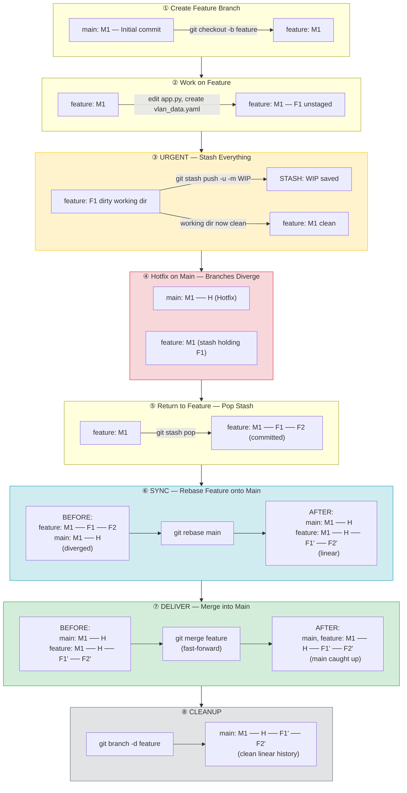

# Git Stash, Sync (Rebase) & Merge — Practice Lab

> **Lab path:** `~/DevnetExpert/mock3/design/git-ops`  
> **Setup:** Nested `.git` inside parent DevnetExpert repo, excluded via `../design/.gitignore` → `/git-ops/.git/`

---

## Step 1 — Initialize and First Commit on Main

```bash
cd ~/DevnetExpert/mock3/design/git-ops
git init

cat > app.py << 'EOF'
# Network Automation App
import os
def main():
    print("App started")
if __name__ == "__main__":
    main()
EOF

git add app.py
git commit -m "Initial app.py on main"
```

```
* cbe79d1 (main) Initial app.py on main
```

---

## Step 2 — Create Feature Branch and Start Working

```bash
git checkout -b feature-vlan

# Append a function to app.py (>> = append, > = overwrite)
cat >> app.py << 'EOF'
def configure_vlan(vlan_id, name):
    print(f"Configuring VLAN {vlan_id}: {name}")
    # TODO: add NETCONF call here
EOF

# Create a new untracked file
cat > vlan_data.yaml << 'EOF'
vlans:
  - id: 100
    name: MGMT
  - id: 200
    name: DATA
EOF

git status
```

At this point you have:

- `app.py` — **modified** (tracked, changes not staged)
- `vlan_data.yaml` — **untracked** (new file, Git doesn't know about it yet)

---

## Step 3 — Stash Everything (Urgent Work Incoming)

```bash
git stash push -u -m "WIP vlan feature including untracked"
```

The `-u` flag is critical here — without it, `vlan_data.yaml` stays behind.

```bash
# Verify everything is clean
git status
# nothing to commit, working tree clean

ls
# Only app.py — vlan_data.yaml is stashed too

git stash list
# stash@{0}: On feature-vlan: WIP vlan feature including untracked
```

---

## Step 4 — Do the Urgent Hotfix on Main

```bash
git checkout main

# Quick edit (sed = command-line find-and-replace, or use VSCode)
sed -i 's/print("App started")/print("App started v1.1 - hotfix")/' app.py

git add app.py
git commit -m "Hotfix: version bump"
```

Graph now shows **divergence** — main has a commit that feature doesn't:

```
      b7c549d  feature-vlan (stashed, no new commits yet)
     /
cbe79d1 --- 36ff161  main (Hotfix)
```

---

## Step 5 — Return to Feature and Restore Stash

```bash
git checkout feature-vlan

# Method A: pop (restore + remove from stash)
git stash pop

# Method B: apply (restore + keep in stash)
git stash apply        # then manually: git stash drop
```

Stage and commit the restored work:

```bash
git add .
git commit -m "staging files after stash in feature-vlan"
```

---

## Step 6 — Multiple Stashes (Exam Edge Case)

Git stash is a **stack** (LIFO — last in, first out):

```bash
echo "# change 1" >> app.py
git stash push -m "change-1"

echo "# change 2" >> app.py
git stash push -m "change-2"

git stash list
# stash@{0}: On feature-vlan: change-2    ← most recent (top)
# stash@{1}: On feature-vlan: change-1    ← older (bottom)

# Apply a specific stash by index
git stash apply stash@{1}     # Gets change-1, skips change-2

# View contents without applying
git stash show stash@{0}

# Drop individually
git stash drop stash@{0}
```

---

## Git Stash — Command Reference

| Command | What It Does |
|---|---|
| `git stash` | Save tracked modified/staged files to the stash stack |
| `git stash push -m "msg"` | Same as above, with a descriptive label |
| `git stash push -u -m "msg"` | Stash tracked + **untracked** files |
| `git stash push -a -m "msg"` | Stash tracked + untracked + **ignored** files |
| `git stash list` | Show all stash entries |
| `git stash show` | Show file diff summary of latest stash |
| `git stash show -p` | Show full patch/diff of latest stash |
| `git stash pop` | Restore latest stash **and remove** it from stack |
| `git stash apply` | Restore latest stash **but keep** it in stack |
| `git stash apply stash@{N}` | Restore a specific stash entry by index |
| `git stash drop` | Delete latest stash without applying |
| `git stash drop stash@{N}` | Delete a specific stash entry |
| `git stash clear` | Delete **all** stash entries |

### Exam-Relevant: What Restores Stashed Work?

| Choice | Restores? | Why |
|---|---|---|
| `git stash pop` | ✅ Yes | Restores + removes from stack |
| `git stash apply` | ✅ Yes | Restores + keeps in stack |
| `git stash` | ❌ No | Only **saves** — doesn't restore |
| `git apply` | ❌ No | Applies **patch files** (`format-patch`), not stash |

### Stash Flag Cheatsheet

| Flag | Stashes |
|---|---|
| *(no flag)* | Tracked modified/staged only |
| `-u` / `--include-untracked` | Tracked + untracked |
| `-a` / `--all` | Tracked + untracked + ignored |

---

## Step 7 — Sync Feature with Main (Rebase)

### Why Sync First?

After the hotfix, main has moved ahead. Feature-vlan doesn't have the hotfix:

```
BEFORE rebase (branches diverged):

      b7c549d --- d7b6d07    feature-vlan
     /
cbe79d1 --- 36ff161           main (Hotfix)
```

If you merge feature into main now, you risk conflicts at the worst time — on the shared `main` branch. **Sync first, break things on your own branch.**

### Rebase = Replay Your Commits on Top of Latest Main

```bash
git checkout feature-vlan
git rebase main
```

Git takes your feature commits, temporarily removes them, fast-forwards to main's tip, then **replays** your commits one by one on top:

```
AFTER rebase (linear history):

cbe79d1 --- 36ff161 --- cfefd77 --- ea937f1    feature-vlan
                ↑
              main
```

Notice commit hashes changed — rebase creates **new** commits because the parent changed:

| Before Rebase | After Rebase | Same Content? |
|---|---|---|
| `b7c549d` | `cfefd77` | Yes — same changes, new hash |
| `d7b6d07` | `ea937f1` | Yes — same changes, new hash |

Feature-vlan now has the hotfix **and** sits cleanly ahead of main.

```bash
git log --oneline --graph --all
# * ea937f1 (HEAD -> feature-vlan) adding test for stas list
# * cfefd77 staging files after stash in feature-vlan
# * 36ff161 (main) Hotfix: version bump
# * cbe79d1 Initial app.py on main
```

---

## Step 8 — Merge Feature into Main (Deliver)

### What Merge Does Here

Main is directly behind feature-vlan — a straight line. Git doesn't need to create a merge commit, it just moves the `main` pointer forward. This is called a **fast-forward**:

```bash
git checkout main
git merge feature-vlan
# Fast-forward
```

```
BEFORE merge:
cbe79d1 --- 36ff161 --- cfefd77 --- ea937f1
                ↑                       ↑
              main              feature-vlan

AFTER fast-forward:
cbe79d1 --- 36ff161 --- cfefd77 --- ea937f1
                                        ↑
                                 main, feature-vlan
```

No 5th merge commit — main just "caught up."

### When Does Git Create a Merge Commit?

Only when branches **diverge** (both have unique commits the other doesn't):

```
          F1 --- F2     feature
         /
M1 --- M2 --- M3       main    ← main has M3 that feature doesn't

git merge feature →

          F1 --- F2
         /           \
M1 --- M2 --- M3 --- M    ← merge commit required (5th commit)
```

### Force a Merge Commit (Even on Straight Line)

```bash
git merge --no-ff feature-vlan
```

Useful when you want history to explicitly show "a feature was integrated here."

---

## Step 9 — Cleanup

```bash
git branch -d feature-vlan
git stash clear
git log --oneline --graph
```

Final clean graph:

```
* ea937f1 (HEAD -> main) adding test for stas list
* cfefd77 staging files after stash in feature-vlan
* 36ff161 Hotfix: version bump
* cbe79d1 Initial app.py on main
```

---

## Summary — The Complete Workflow

```
1. git checkout -b feature         Create feature branch
2. (work, edit files)              Make changes
3. git stash push -u -m "WIP"     Urgent interrupt — stash everything
4. git checkout main               Handle urgent work
5. (hotfix, commit)                Fix and commit on main
6. git checkout feature            Return to feature
7. git stash pop                   Restore stashed work
8. git add . && git commit         Commit the feature work
9. git rebase main                 Sync — replay feature on top of main
10. git checkout main              Switch to main
11. git merge feature              Deliver — fast-forward merge
12. git branch -d feature          Cleanup
```

### Graphical View of the Workflow



**Color key:**
- 🟡 **Yellow** — Stash (interrupt)
- 🔴 **Red** — Divergence (problem)
- 🔵 **Blue** — Rebase/Sync (fix the divergence)
- 🟢 **Green** — Merge/Deliver (done)
- ⚪ **Grey** — Cleanup

### When to Use What

| Task | Command | Why |
|---|---|---|
| Sync feature with main | `git rebase main` | Linear history, catches conflicts on YOUR branch |
| Deliver feature to main | `git merge feature` | Integrates finished work |
| Shared branch (team) | `git merge main` (not rebase) | Rebase rewrites history — dangerous if others have the branch |
| Force merge commit | `git merge --no-ff feature` | Preserves "feature delivered here" marker in history |

### Golden Rule

> **Rebase to sync, merge to deliver. Break things on your branch, not on main.**