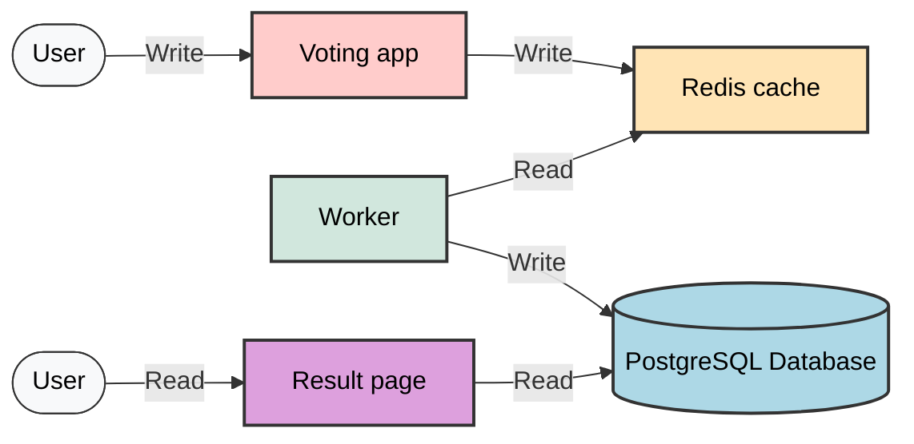

# Challenge 402: Kubernetes 5-tier Application

## Background Information

The election day is coming up, and it is time to decide who should rule the universe! Your company is providing the digital voting booth and poll results page.

The application is built with a microservice architecture, and your task is to get it up and running on an existing Kubernetes cluster.

## Application Components

It consists of 5 individual components:

| Name | Availability | Description |
|------|-------------|-------------|
| Voting app | External frontend | Receives votes through a web interface and queues them on to Redis |
| Redis cache | Internal backend | Stores casted votes until a worker is ready to pick them up |
| Worker | Internal backend | Reads votes from the Redis cache and stores them in the database |
| Database | Internal backend | PostgreSQL database for permanent storage |
| Result page | External frontend | Read the database and presents the result on a web page |

## Architecture Diagram

The high level topology of the components and the data flow:




### Data Flow:
1. **User writes vote** → Voting app (External frontend)
2. **Voting app** → Redis cache (Temporary storage)
3. **Worker** reads from Redis cache → PostgreSQL Database (Permanent storage)
4. **Result page** reads from PostgreSQL Database → **User reads results**

## Task Requirements

Five unfinished Kubernetes configuration files are provided for you. You must complete the configuration by adding code to the files:

- `1-voting-app.yml`
- `2-redis-cache.yml` 
- `3-worker.yml`
- `4-postgresql-database.yml`
- `5-result-page.yml`

### Important Notes:

- You do **not** need to request any storage volumes for the pods
- The files are marked with `##-comment` blocks referring to the requirement ID
- The placement of the `##-comment` is always at the top of the file and **NOT** at the correct YAML section
- You must determine the appropriate YAML sections where the necessary code should be added to the configuration files
- **Do not change** any of the YAML data that is already present in the files

### Component Details:

#### External Components (Accessible from outside the cluster):
- **Voting app**: Web interface for casting votes
- **Result page**: Web interface for viewing election results

#### Internal Components (Backend services):
- **Redis cache**: Temporary vote storage and message queue
- **Worker**: Background service that processes votes from Redis to PostgreSQL
- **PostgreSQL Database**: Permanent storage for processed votes

## Requirements

**Note:** To test your skills with Kubernetes configuration there are no placeholder comments in the YAML files. You must determine the appropriate YAML sections where the necessary code should be added to the configuration files. You are allowed to add code, but not change any of the existing code.

### Voting App Requirements (1-voting-app.yml):
- **A.** The voting pods must run the Docker image `dockersamples/examplevotingapp_vote`
- **B.** The voting deployment must create a replicaset with 2 pods
- **C.** When the voting pods are updated, Kubernetes must ensure that some pods are kept running all the time
- **D.** The voting service must create an external IP address that load balances TCP port 80 connections to the pods

### Redis Cache Requirements (2-redis-cache.yml):
- **E.** Ensure that other services in the application can access the redis pods via a ClusterIP service using the hostname "redis"

### Worker Requirements (3-worker.yml):
- **F.** The worker deployment must create a replicaset with 2 pods, and both of them must be terminated simultaneously when the pod image is updated
- **G.** Add the missing selector and metadata

### PostgreSQL Database Requirements (4-postgresql-database.yml):
- **H.** Postgres pods must run with the following environment variables:
  - **Name:** POSTGRES_USER  
    **Value:** Refer to the secret with the name=challenge-402-db and key=username
  - **Name:** POSTGRES_PASSWORD  
    **Value:** Refer to the secret with the name=challenge-402-db and key=password
  - **Name:** POSTGRES_HOST_AUTH_METHOD  
    **Value:** trust
- **I.** Ensure the service database is reachable through the service

### Result Page Requirements (5-result-page.yml):
- **J.** The result service must create an external IP address that load-balances TCP connections to the pods' exposed ports. Users will access the result page with HTTP on port 8001.

### Autoscale and Manual Scaling
- **K.** Manualcale voting for replicas=4, it would give you following result
```
sushil@ubuntupro:~/DevnetExpert/mock3/e1-kubernetes$ kubectl get deployments
NAME                     READY   UP-TO-DATE   AVAILABLE   AGE
voting-deployment        4/4     4            4           10m
```
- **L.** Autoscale result deployment for min=3, max=4 for desired-CPU=5 [if doesn't work, try=10]
```
sushil@ubuntupro:~/DevnetExpert/mock3/e1-kubernetes$ kubectl get deployments
NAME                     READY   UP-TO-DATE   AVAILABLE   AGE
result-deployment         3/3     3            3           10m
```


## Testing

You can test the voting app by casting votes from different browsers or computers, and accessing the result page.

## Deployment Commands

**Tip:** You can apply and delete all the Kubernetes configuration from YAML files in a folder like this:

```bash
kubectl apply -f .
kubectl delete -f .
```

## Current YAML Files

### 1-voting-app.yml (Requirements A, B, C and D)
```yaml
## Requirements A, B, C and D
---
apiVersion: apps/v1
kind: Deployment
metadata:
  name: voting-deployment
spec:
  selector:
    matchLabels:
      app: voting-pod
  template:
    metadata:
      labels:
        app: voting-pod
    spec:
      containers:
        - name: voting-container
          ports:
            - containerPort: 80
          resources:
            limits:
              cpu: 250m
              ephemeral-storage: 10Mi
              memory: 512Mi
            requests:
              cpu: 250m
              ephemeral-storage: 10Mi
              memory: 512Mi
---
apiVersion: v1
kind: Service
metadata:
  name: voting-service #http://voting-service
```

**Missing configurations:**
- A. The voting pods must run the Docker image dockersamples/examplevotingapp_vote 
- B. The voting deployment must create a replicaset with 2 pods
- C. When the voting pods are updated, Kubernetes must ensure that some pods are kept running all the time
- D. The voting service must create an external IP address that load balances TCP port 80 connections to the pods

### 2-redis-cache.yml (Requirement E)
```yaml
## Requirement E
---
apiVersion: apps/v1
kind: Deployment
metadata:
  name: redis-queue-deployment
spec:
  selector:
    matchLabels:
      app: redis-queue-pod
  template:
    metadata:
      labels:
        app: redis-queue-pod
    spec:
      containers:
        - name: redis-queue-container
          image: redis:latest
          ports:
            - containerPort: 6379
          resources:
            limits:
              cpu: 250m
              ephemeral-storage: 10Mi
              memory: 512Mi
            requests:
              cpu: 250m
              ephemeral-storage: 10Mi
              memory: 512Mi
---
apiVersion: v1
kind: Service
metadata:
  name: #! TODO-E
spec:
  ports:
    - port: 6379
      targetPort: 6379
  selector:
    app: #! TODO-E
```

**Missing configurations:**
- E. Ensure that other services in the application can access the redis pods via a ClusterIP service using the hostname "redis"
- Complete selector configuration

### 3-worker.yml (Requirements F and G)
```yaml
## Requirements F and G
---
apiVersion: apps/v1
kind: Deployment
metadata:
  name: worker-deployment
spec:
  template:
    spec:
      containers:
        - name: worker-container
          image: dockersamples/examplevotingapp_worker
          resources:
            limits:
              cpu: 250m
              ephemeral-storage: 10Mi
              memory: 512Mi
            requests:
              cpu: 250m
              ephemeral-storage: 10Mi
              memory: 512Mi
```

**Missing configurations:**
- F. The worker deployment must create a replicaset with 2 pods, and both of them must be terminated simultaneously when the pod image is updated
- G. Add the missing selector and metadata

### 4-postgresql-database.yml (Requirements H and I)
```yaml
## Requirement H and I
apiVersion: apps/v1
kind: Deployment
metadata:
  name: db-deployment
spec:
  selector:
    matchLabels:
      app: db-pod
  template:
    metadata:
      labels:
        app: db-pod
    spec:
      containers:
        - name: db-container
          image: postgres:9.4
          resources:
            limits:
              cpu: 250m
              ephemeral-storage: 10Mi
              memory: 512Mi
            requests:
              cpu: 250m
              ephemeral-storage: 10Mi
              memory: 512Mi
---
apiVersion: v1
kind: Service
metadata:
  name: db # <-- critical: default hostname the app expects
  labels:
    app: db
spec:
  ports:
    - port: 5432
      targetPort: 5432
  selector:
    app: db-pod
```

**Missing configurations:**
- H. Postgres pods must run with the following environment variables:

      Name: POSTGRES_USER
      Value: Refer to the secret with the name=challenge-402-db and key=username
      Name: POSTGRES_PASSWORD
      Value: Refer to the secret with the name=challenge-402-db and key=password
      Name: POSTGRES_HOST_AUTH_METHOD
      Value: trust

- I. Ensure the service database is reachable through the service

### 5-result-page.yml (Requirement J)
```yaml
## Requirement J
apiVersion: apps/v1
kind: Deployment
metadata:
  name: result-deployment
spec:
  selector:
    matchLabels:
      app: result-pod
  template:
    metadata:
      labels:
        app: result-pod
    spec:
      containers:
        - name: result-container
          image: dockersamples/examplevotingapp_result
          ports:
            - containerPort: 80
          resources:
            limits:
              cpu: 250m
              ephemeral-storage: 10Mi
              memory: 512Mi
            requests:
              cpu: 250m
              ephemeral-storage: 10Mi
              memory: 512Mi
---
apiVersion: v1
kind: Service
metadata:
  name: result-service # user access http://result-service:8001
```

**Missing configurations:**
- J. The result service must create an external IP address that load-balances TCP connections to the pods' exposed ports. Users will access the result page with HTTP on port 8001.

## Completion

When you are finished with the challenge, commit your code to the main branch, and push it to the remote repository.

## Solution (Last Resort)

<details>
<summary>1-voting-app.yml Solution</summary>

```yaml
## Requirements A, B, C and D
---
apiVersion: apps/v1
kind: Deployment
metadata:
  name: voting-deployment
spec:
# Pod management/Deploymnet controller configs
  replicas: 2 # Requirement B #Tasks → Run Applications → Run a Stateless Application Using a Deployment
  strategy:
    type: RollingUpdate # Requirement C Tasks → Run Applications → Run a Single-Instance Stateful Application
  selector:
    matchLabels:
      app: voting-pod # Need to match with template/metadata/labels/app
                  # Controls which pods get updated/deleted during deployments

# Pod Creation template
  template:
    metadata:
      labels:
        app: voting-pod # Need to match with selector/matchLabels/app
                    # Defines what labels new pods will have when created
    spec:
      containers:
        - name: voting-container # Independent name for the container
          image: dockersamples/examplevotingapp_vote # Requirement A #Tasks → Run Applications → Run a Stateless Application Using a Deployment
          ports:
            - containerPort: 80  # The container listen to this port
          resources:
            limits:
              cpu: 250m
              ephemeral-storage: 10Mi
              memory: 512Mi
            requests:
              cpu: 250m
              ephemeral-storage: 10Mi
              memory: 512Mi
---
apiVersion: v1
kind: Service
metadata:
  name: voting # Service's own name
spec:
  selector:
    app: voting-pod # This has to match of Deployment template/metadata/labels/app
  ports:
    - protocol: TCP
      port: 80 # Requirement D. Loadbalancer external port to host/users
      targetPort: 80 # Routes to voting-container ports/containerPort=80
  type: LoadBalancer # Requirement D for External Access #Concepts → Services, Load Balancing, and Networking → Service
```

</details>

<details>
<summary>2-redis-cache.yml Solution</summary>

```yaml
## Requirement E
---
apiVersion: apps/v1
kind: Deployment
metadata:
  name: redis-queue-deployment
spec:
  selector:
    matchLabels:
      app: redis-queue-pod # Need to match with pod name at the creation template/metadata/labels/app
  template:
    metadata:
      labels:
        app: redis-queue-pod # It's name for pod lable used during creation. It needs to match with Deployment/selector/matchLabels
                         # so that it can be managed by selector
    spec:
      containers:
        - name: redis-queue-container #Standalone container name
          image: redis:latest
          ports:
            - containerPort: 6379
          resources:
            limits:
              cpu: 250m
              ephemeral-storage: 10Mi
              memory: 512Mi
            requests:
              cpu: 250m
              ephemeral-storage: 10Mi
              memory: 512Mi
---
apiVersion: v1
kind: Service
metadata:
  name: redis # Requirement E. Other services in the application can access the redis pods via a ClusterIP service using the hostname "redis"
spec:
  type: ClusterIP # Concepts → Services, Load Balancing, and Networking → Service
  ports:
    - port: 6379 # Port exposed by the service for other pods to connect
      targetPort: 6379 # Connecting to the redis-queue-container through this port
  selector:
    app: redis-queue-pod
```

</details>

<details>
<summary>3-worker.yml Solution</summary>

```yaml
## Requirements F and G
---
apiVersion: apps/v1
kind: Deployment
metadata:
  name: worker-deployment
spec:
  replicas: 2 #! F
  strategy:
    type: Recreate #! F
  selector:         #! G
    matchLabels:
      app: worker-pod

  template:
    metadata:
      labels:
        app: worker-pod
    spec:
      containers:
        - name: worker-container
          image: dockersamples/examplevotingapp_worker
          resources:
            limits:
              cpu: 250m
              ephemeral-storage: 10Mi
              memory: 512Mi
            requests:
              cpu: 250m
              ephemeral-storage: 10Mi
              memory: 512Mi
```

</details>

<details>
<summary>4-postgresql-database.yml Solution</summary>

```yaml
## Requirement H and I
apiVersion: apps/v1
kind: Deployment
metadata:
  name: db-deployment
spec:
  selector:
    matchLabels:
      app: db-pod
  template:
    metadata:
      labels:
        app: db-pod
    spec:
      containers:
        - name: db-container
          image: postgres:9.4
          resources:
            limits:
              cpu: 250m
              ephemeral-storage: 10Mi
              memory: 512Mi
            requests:
              cpu: 250m
              ephemeral-storage: 10Mi
              memory: 512Mi
          env:                          # Requirement H #Concepts → Configuration → Secrets → Using Secrets as environment variables
                                        # https://kubernetes.io/docs/tasks/inject-data-application/distribute-credentials-secure/#define-container-environment-variables-using-secret-data
            - name: POSTGRES_USER
              valueFrom:
                secretKeyRef:
                  name: challenge-402-db
                  key: username

            - name: POSTGRES_PASSWORD
              valueFrom:
                secretKeyRef:
                  name: challenge-402-db
                  key: password
            - name: POSTGRES_HOST_AUTH_METHOD
              value: "trust"

---
apiVersion: v1
kind: Service
metadata:
  name: db # <-- critical: default hostname the app expects
  labels:
    app: db
spec:
  type: ClusterIP # Requirement I: Internal database access
  ports:
    - port: 5432
      targetPort: 5432
  selector:
    app: db-pod
```

</details>

<details>
<summary>5-result-page.yml Solution</summary>

```yaml
## Requirement J
apiVersion: apps/v1
kind: Deployment
metadata:
  name: result-deployment
spec:
  selector:
    matchLabels:
      app: result-pod
  template:
    metadata:
      labels:
        app: result-pod
    spec:
      containers:
        - name: result-container
          image: dockersamples/examplevotingapp_result
          ports:
            - containerPort: 80
          resources:
            limits:
              cpu: 250m
              ephemeral-storage: 10Mi
              memory: 512Mi
            requests:
              cpu: 250m
              ephemeral-storage: 10Mi
              memory: 512Mi
---
apiVersion: v1
kind: Service
metadata:
  name: result # user access http://result-service:8001
spec:
  selector:
    app: result-pod
  ports:
    - protocol: TCP
      port: 8001
      targetPort: 80
  type: LoadBalancer
```

</details>

## Additional Files to Run All the App

<details>
<summary>Secret Configuration (secret.yml)</summary>

```yaml
apiVersion: v1 
kind: Secret
metadata:
  name: challenge-402-db
type: Opaque
data:
  password: cG9zdGdyZXM= # base64 encoded "postgres"
  username: cG9zdGdyZXM= # base64 encoded "postgres"
```

Apply this before deploying the database:
```bash
kubectl apply -f secret.yml
```

</details>

<details>
<summary>MetalLB IP Pool Configuration (metallb-ippool.yaml)</summary>

```yaml
# metallb-ippool.yaml
apiVersion: metallb.io/v1beta1
kind: IPAddressPool
metadata:
  name: lab-pool
  namespace: metallb-system
spec:
  addresses:
  - 192.168.89.230-192.168.89.250  # Use IPs that won't conflict
---
apiVersion: metallb.io/v1beta1
kind: L2Advertisement
metadata:
  name: lab-advertisement
  namespace: metallb-system
spec:
  ipAddressPools:
  - lab-pool
```

Apply this to configure MetalLB IP allocation:
```bash
kubectl apply -f metallb-ippool.yaml
```

</details>

## Solution Notes

<details>
<summary>Deployment and Testing Notes</summary>

### Run following command to test the APP
```
kubectl apply -f .
```
```bash
sushil@ubuntupro:~/DevnetExpert/workbook/ch17-Kubernetes/C402-Kubernetes-5tier$ kubectl apply -f .
deployment.apps/voting created
service/voting unchanged
deployment.apps/redis-queue unchanged
service/redis unchanged
deployment.apps/worker created
deployment.apps/db unchanged
service/db unchanged
deployment.apps/result unchanged
service/result unchanged
```
### kubectl get services
```
kubectl get services
```
```
sushil@ubuntupro:~/DevnetExpert/workbook/ch17-Kubernetes/C402-Kubernetes-5tier$ kubectl get services
NAME         TYPE           CLUSTER-IP     EXTERNAL-IP     PORT(S)          AGE
db           ClusterIP      10.43.68.31    <none>          5432/TCP         8m37s
kubernetes   ClusterIP      10.43.0.1      <none>          443/TCP          73d
redis        ClusterIP      10.43.212.46   <none>          6379/TCP         8m37s
result       LoadBalancer   10.43.34.226   192.168.89.72   8001:30838/TCP   8m37s
voting       LoadBalancer   10.43.101.2    192.168.89.71   80:32471/TCP     8m37s
```
### kubectl get pods
```
kubectl get pods
```
```
sushil@ubuntupro:~/DevnetExpert/workbook/ch17-Kubernetes/C402-Kubernetes-5tier$ kubectl get pods
NAME                           READY   STATUS                       RESTARTS   AGE
db-74d7b65c5f-mc8bs            0/1     CreateContainerConfigError   0          10m
redis-queue-5fdc9d9f85-5p94t   1/1     Running                      0          10m
result-6c9fc59d78-chzv4        1/1     Running                      0          10m
voting-69dc8499d9-8wvhl        1/1     Running                      0          9m8s
voting-69dc8499d9-lfxm6        1/1     Running                      0          9m8s
worker-78d855bdc4-4bdr9        1/1     Running                      0          9m8s
worker-78d855bdc4-d4mqd        1/1     Running                      0          9m8s
```
#### **Note: The issue is that your PostgreSQL database pod is not running properly. Look at the status:
```
db-74d7b65c5f-mc8bs            0/1     CreateContainerConfigError   0          10m
```
### Fix: Create the Database Secret
#### Run this command immediately:
```
kubectl create secret generic challenge-402-db \
  --from-literal=username=postgres \
  --from-literal=password=postgres
```

```bash
sushil@ubuntupro:~/DevnetExpert/workbook/ch17-Kubernetes/C402-Kubernetes-5tier$ kubectl create secret generic challenge-402-db \
  --from-literal=username=postgres \
  --from-literal=password=postgres
```

### Database pods are running now
```
sushil@ubuntupro:~/DevnetExpert/workbook/ch17-Kubernetes/C402-Kubernetes-5tier$ kubectl get pods
NAME                           READY   STATUS    RESTARTS   AGE
db-74d7b65c5f-mc8bs            1/1     Running   0          16m
redis-queue-5fdc9d9f85-5p94t   1/1     Running   0          16m
result-6c9fc59d78-chzv4        1/1     Running   0          16m
voting-69dc8499d9-8wvhl        1/1     Running   0          14m
voting-69dc8499d9-lfxm6        1/1     Running   0          14m
worker-78d855bdc4-4bdr9        1/1     Running   0          14m
worker-78d855bdc4-d4mqd        1/1     Running   0          14m
```

### Cast the vote and Check the result
```
for voting http://192.168.89.71:80
for resutl http://192.168.89.72:8001
```

### After testing delete all pods
```
sushil@ubuntupro:~/DevnetExpert/workbook/ch17-Kubernetes/C402-Kubernetes-5tier$ kubectl delete -f .
deployment.apps "voting" deleted
service "voting" deleted
deployment.apps "redis-queue" deleted
service "redis" deleted
deployment.apps "worker" deleted
deployment.apps "db" deleted
service "db" deleted
deployment.apps "result" deleted
service "result" deleted
```
### Manual and Auto Scaling
```
sushil@ubuntupro:~/DevnetExpert/mock3/e1-kubernetes$ kubectl get deployments
NAME            READY   UP-TO-DATE   AVAILABLE   AGE
db-deployment   1/1     1            1           4m42s
redis-queue     1/1     1            1           4m42s
result          1/1     1            1           4m42s
voting          4/4     4            4           4m42s
worker          2/2     2            2           4m42s
```
```
sushil@ubuntupro:~/DevnetExpert/mock3/e1-kubernetes$ kubectl autoscale deployment/result --min=2 --max=4
horizontalpodautoscaler.autoscaling/result autoscaled
```
```
sushil@ubuntupro:~/DevnetExpert/mock3/e1-kubernetes$ kubectl scale --replicas=4 deployment voting-deployment
deployment.apps/voting-deployment scaled
```
```
sushil@ubuntupro:~/DevnetExpert/mock3/e1-kubernetes$ kubectl delete hpa result
horizontalpodautoscaler.autoscaling "result" deleted

sushil@ubuntupro:~/DevnetExpert/mock3/e1-kubernetes$ kubectl autoscale deployment result --min=2 --max=4 --cpu-percent=80
horizontalpodautoscaler.autoscaling/result autoscaled
```
### Delete Secrets
```
kubectl get secrets
```
```bash
sushil@ubuntupro:~/DevnetExpert/workbook/ch17-Kubernetes/C402-Kubernetes-5tier$ kubectl get secrets
NAME               TYPE     DATA   AGE
challenge-402-db   Opaque   2      20m

sushil@ubuntupro:~/DevnetExpert/workbook/ch17-Kubernetes/C402-Kubernetes-5tier$ kubectl delete secrets challenge-402-db
secret "challenge-402-db" deleted

sushil@ubuntupro:~/DevnetExpert/mock3/e1-kubernetes$ kubectl get hpa
NAME                 REFERENCE                       TARGETS              MINPODS   MAXPODS   REPLICAS   AGE
task172-deployment   Deployment/task172-deployment   cpu: <unknown>/10%   2         3         2          87d
voting-deployment    Deployment/voting-deployment    cpu: 0%/80%          1         2         2          9m20s

sushil@ubuntupro:~/DevnetExpert/mock3/e1-kubernetes$ kubectl delete hpa voting-deployment
horizontalpodautoscaler.autoscaling "voting-deployment" deleted

```

</details>